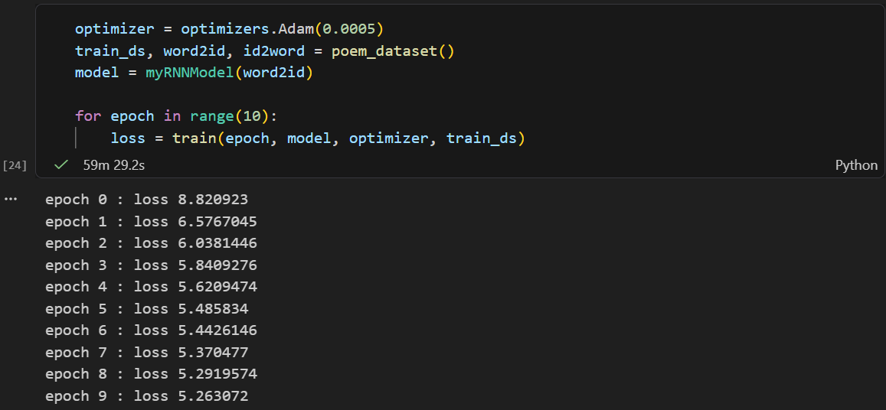
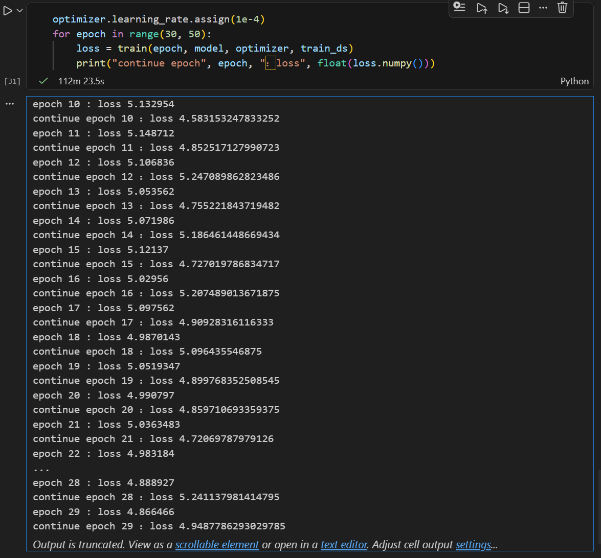
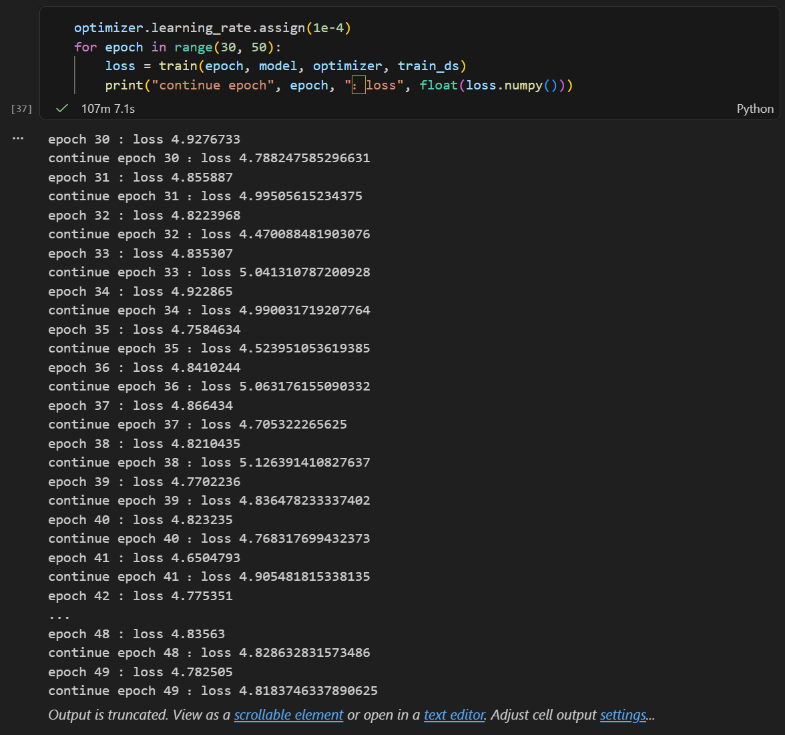
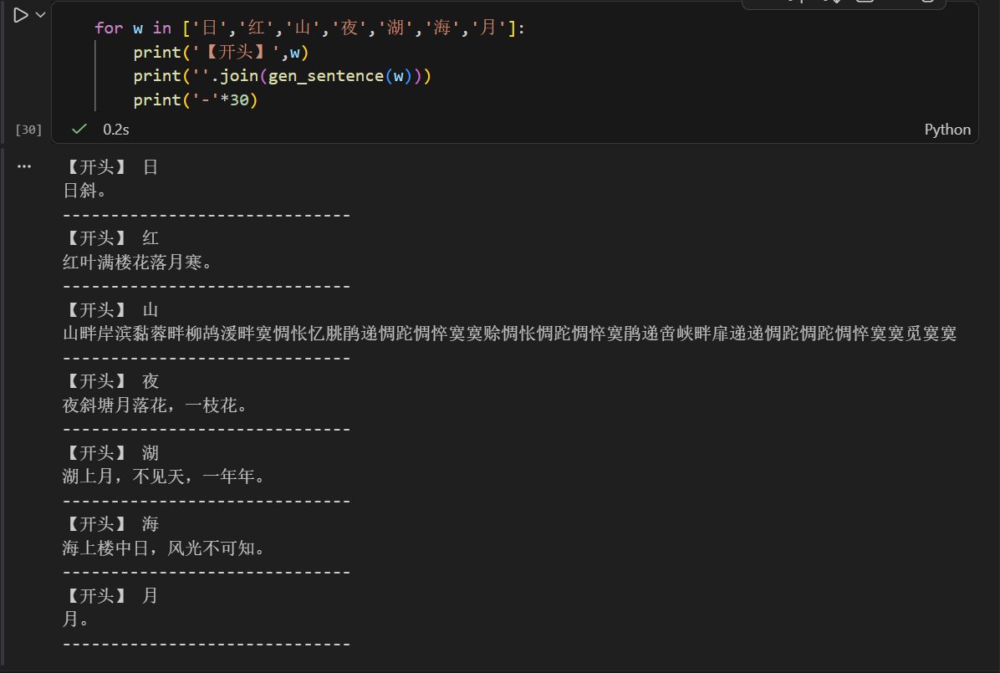
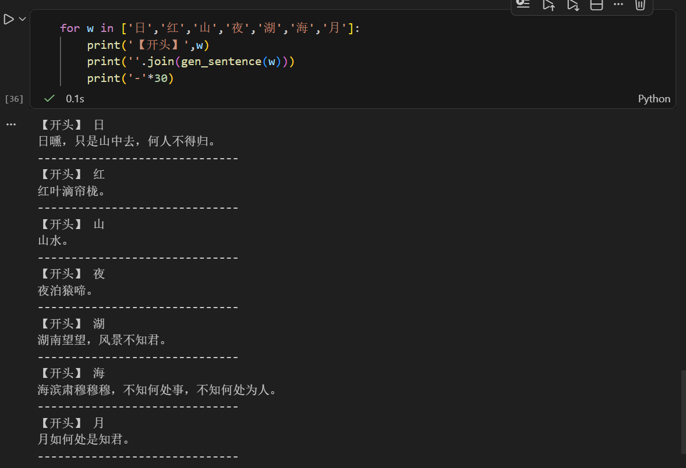
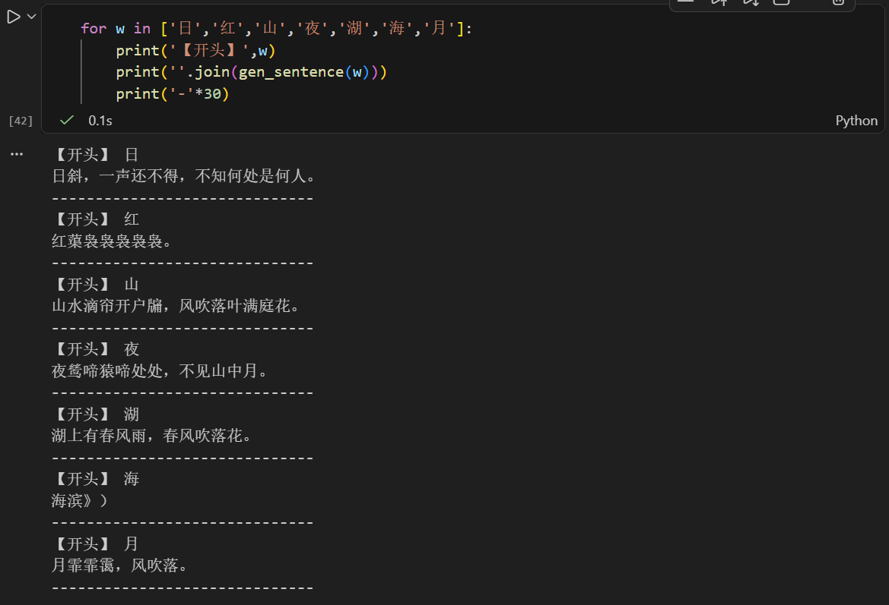

# chpt_6 - RNN 报告

姓名：王莹  
学号：2054328

## 1.解释 RNN、LSTM、GRU 模型

### 1.1 RNN 模型

RNN（Recurrent Neural Network）是一类处理序列数据的神经网络。与普通前馈网络不同，RNN 在时刻 $t$ 的输出不仅依赖当前输入 $x_t$，还依赖上一时刻的隐藏状态 $h_{t-1}$，因此可以建模上下文信息。

其基本形式可写为：

$$
h_t = \phi(W_x x_t + W_h h_{t-1} + b_h)
$$

$$
y_t = W_y h_t + b_y
$$

其中，$\phi$ 常用 $\tanh$ 或 ReLU。RNN 的优点是结构简单，能够表达时序依赖；缺点是在长序列上容易出现梯度消失或梯度爆炸。

---

### 1.2 LSTM 模型

LSTM 是 RNN 的改进结构，核心是引入细胞状态 $c_t$ 和门控机制（遗忘门、输入门、输出门），从而缓解普通 RNN 对长依赖建模困难的问题。

常见计算形式：

$$
f_t = \sigma(W_f[x_t, h_{t-1}] + b_f)
$$

$$
i_t = \sigma(W_i[x_t, h_{t-1}] + b_i), \quad \tilde{c}_t = \tanh(W_c[x_t, h_{t-1}] + b_c)
$$

$$
c_t = f_t \odot c_{t-1} + i_t \odot \tilde{c}_t
$$

$$
o_t = \sigma(W_o[x_t, h_{t-1}] + b_o), \quad h_t = o_t \odot \tanh(c_t)
$$

LSTM 的主要优势是能更稳定地保留长期信息。

---

### 1.3 GRU 模型

GRU（Gated Recurrent Unit）可以看作 LSTM 的简化版本，使用更新门和重置门来控制信息流，参数更少、训练更快。

其常见形式为：

$$
z_t = \sigma(W_z[x_t, h_{t-1}] + b_z), \quad r_t = \sigma(W_r[x_t, h_{t-1}] + b_r)
$$

$$
\tilde{h}_t = \tanh(W_h[x_t, r_t \odot h_{t-1}] + b_h)
$$

$$
h_t = (1-z_t) \odot h_{t-1} + z_t \odot \tilde{h}_t
$$

GRU 在不少任务上效果接近 LSTM，但结构更轻量。

---

## 2.叙述诗歌生成过程

本实验使用 TensorFlow 版本实现中文诗歌生成，整体流程如下：

1. 读取数据集 `poems.txt`，为每条样本加上起始标记 `bos` 和结束标记 `eos`。
2. 构建词表 `word2id`、`id2word`，将汉字序列转成 id 序列。
3. 构建 `tf.data` 数据管道，输入为 `x[:, :-1]`，标签为 `x[:, 1:]`。
4. 模型结构采用：Embedding(64) -> SimpleRNNCell(128) -> Dense(vocab_size)。
5. 训练时使用交叉熵损失并按有效序列长度做平均。
6. 生成时给定 `begin_word`，逐步预测下一个 token，遇到 `eos` 或达到最大长度停止。

我在代码中做了与当前环境相关的一些必要兼容处理：

1. 数据路径改为 `./poems.txt`，避免文件找不到。
2. `Embedding` 删除 `batch_input_shape` 参数（适配 Keras 3）。
3. 去除部分 `@tf.function`，否则运行时梯度为 `None` 。

本实验中使用的生成函数如下：

```python
def gen_sentence(begin_word, max_len=50, min_len=12):
    state = [tf.random.normal(shape=(1, 128), stddev=0.5)]
    cur_token = tf.constant([word2id[begin_word]], dtype=tf.int32)
    collect = [word2id[begin_word]]

    for _ in range(max_len):
        cur_token, state = model.get_next_token(cur_token, state)
        tid = int(cur_token.numpy()[0])

        if tid == word2id['eos'] and len(collect) < min_len:
            continue
        if tid == word2id['eos']:
            break

        collect.append(tid)

    return [id2word[t] for t in collect]
```

---

## 3.指定开头词生成结果

按题目要求，使用以下开头词生成：

- 日
- 红
- 山
- 夜
- 湖
- 海
- 月

本次实验生成结果（某次训练结果）如下：

1. 日：日暮雨沾巾看看花。得不知何处处，不知何处是谁家。
2. 红：红蕖。玉双旌下马蹄，一枝红叶不如丝。
3. 山：山茫茫。尽不知此，何人不可知。
4. 夜：夜夜江上，山山一夜深。花开户里，风雨入山山。
5. 湖：湖畔忆往来逢此日期。来不得无人事，不得春风一夜来。
6. 海：海上城边。云山水上，风雨夜中秋。
7. 月：月下门前路，不见春风一夜来。

### 3.1 实验过程截图

1. 训练日志截图：







2. 7 个开头词生成结果截图：







---

## 4.总结

本次实验完成了代码运行与结果分析。

1. 在模型认知方面，理解了 RNN、LSTM、GRU 的结构差异及适用场景。
2. 在实现方面，完成了 TensorFlow 诗歌生成代码的补全与环境适配。
3. 在结果方面，成功实现指定 7 个开头词的诗句生成。

从训练现象看，loss 从初期约 8.82 下降到约 4.8 左右，说明模型已经学习到一定序列模式；但输出中仍有重复词和异常字符，可以看出 SimpleRNN 在复杂文本生成任务中的局限。后续若采用 LSTM/GRU 或其它改进策略或许生成质量还有更大提升空间。
